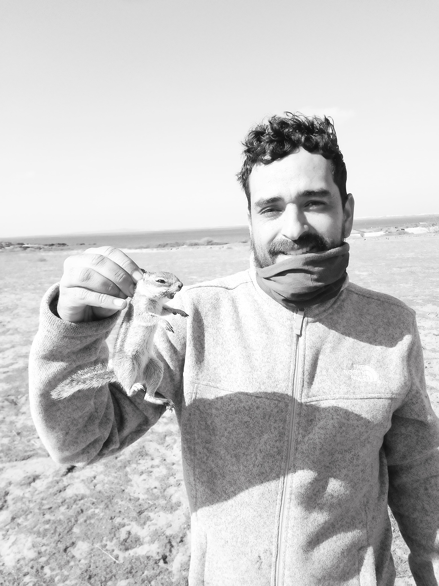

Hello y'all! My name is Jorge Andrade Sánchez. My father's family (Andrade-Murillo) came from one of the oldest families from Baja California Sur (the Murillo family), particularly from La Paz and Santa Rosalía (Choyero lands). My mother's side, the Sánchez-Servín family, took a long journey from Nahuatzen, Michoacan to stablish in San Vicentito, Baja California and latter in El Rosario, Baja California in 1945. I grew up in Ensenada but travelling coastal roads across the peninsula visiting my family. In a sense, I am a true "Bajacaliforniano". The wonders of the peninsula, including the wildlife, enviroments and its remarkable people have had a profound impact on me and made me how I am. In this, personal webpage, I'll share about my research, photography, opinions and more.

{fig-align="center" width="251"}
